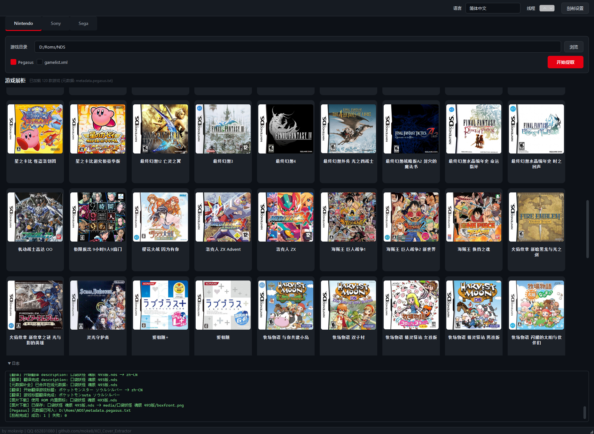

# 老顽童游戏刮削工具

多平台游戏ROM元数据刮削工具。通过解析游戏文件的二进制结构，精确提取游戏 ID、标题等信息，自动匹配在线数据库获取封面图片和元数据。

## 界面预览



## 核心优势

### 从 ROM 本身识别游戏，而不是猜文件名

对于未经整理的 ROM 集合，游戏文件名可能是缩写、中文名、民间命名或带有大量版本标记。普通刮削工具只能依赖文件名搜索；面对几百个 GBA 游戏时，往往需要逐个修正名称、手动匹配和维护封面。

### 特征码 → 标准英文名 → 第三方海报

老顽童游戏刮削工具直接读取 ROM 内部特征。以 GBA 为例，工具从 ROM Header 获取 Game Code，再通过内置 No-Intro 对照库找到对应的标准英文游戏名，最后使用该名称从第三方数据源搜索并下载海报和元数据。

这套流程不依赖用户如何命名 ROM。即使文件被改成中文名或简单编号，仍可根据 ROM 自身信息识别游戏，减少名称猜测造成的错误匹配。

### 更适合大批量游戏整理

对于几百款游戏，工具可以自动完成“识别 ROM → 获取标准名称 → 搜索游戏 → 下载封面 → 整理图片目录 → 写入前端索引”的完整流程，将原本需要大量人工维护的工作变成可重复的批量处理。

### 一次刮削，适配多种前端与设备

工具同时支持天马 G（Pegasus）的 `metadata.pegasus.txt`、EmulationStation 使用的 `gamelist.xml`，以及安伯尼克设备常用的 `Imgs/ROM文件名.<图片格式>` 封面结构。

一次刮削即可生成标准媒体目录、前端索引和安伯尼克兼容封面，无需再为不同系统分别改名、复制或维护图片。

## 支持平台

| 平台 | 文件格式 | 解析方式 |
|------|---------|---------|
| Game Boy Advance | `.gba` `.agb` `.mb` | ROM Header Game Code → No-Intro 数据库查表获取完整英文名 |
| Nintendo DS | `.nds` | ROM 头部多语言标题、Game Code、图标解码 |
| Nintendo 3DS | `.3ds` `.cia` | SMDH 标题解析 |
| PlayStation 1 | `.chd` `.pbp` `.bin/.cue` | SYSTEM.CNF 序列号提取 |
| PlayStation Portable | `.iso` `.cso` `.pbp` | PARAM.SFO 解析（支持 CSO 解压） |
| Nintendo GameCube | `.iso` `.gcm` | DOL/FST 头部解析 |
| Nintendo Wii | `.iso` `.wbfs` | 光盘头部标题 |
| Sega Dreamcast | `.chd` `.gdi` `.cdi` | IP.BIN 元数据 |
| Nintendo Switch | `.xci` | 解密 HFS0/NCA/RomFS，提取 NACP 多语言标题、JPEG 封面 |

所有平台均支持 ZIP 压缩包扫描——自动解压包含单个游戏文件的 ZIP。

## 功能一览

- **封面提取** — Switch 从 XCI 内部提取封面；其他平台从在线数据库下载 boxart
- **统一图片目录** — 新封面固定保存到 `media/<ROM文件名>/boxfront.<原格式>`；默认在刮削前迁移已有索引封面并清理空目录
- **Anbernic 封面兼容** — 可额外生成 `Imgs/<ROM文件名>.<原格式>`，副本不写入 Pegasus 或 `gamelist.xml`，关闭兼容选项后也不会自动删除
- **完整刮削日志** — 启动时输出脱敏后的全部配置，执行中按文件扫描、游戏解析、游戏搜索、图片下载、图片整理、索引写入等业务前缀记录过程与统计
- **在线元数据补全** — 支持 TheGamesDB、IGDB、ScreenScraper、Wikipedia 四种数据源
- **手动搜索** — 右键游戏卡片可手动输入关键词搜索，支持一键从 ROM 提取英文名
- **多语言支持** — 16 种语言可选（含简繁中文智能识别），支持 Google Translate 翻译
- **视频支持** — 获取 YouTube 视频链接写入元数据
- **多线程处理** — 可配置线程数（1~16），并行处理加速批量刮削
- **元数据输出** — 生成 `metadata.pegasus.txt`（Pegasus Frontend）和 `gamelist.xml`（Anbernic / EmulationStation）
- **代理支持** — HTTP/SOCKS 代理
- **图形界面** — PySide6 构建，游戏画廊展示、右键菜单操作、日志实时输出

## 使用方法

### 直接运行（Python 3.8+）

```bash
pip install -r requirements.txt
python main.py
```

### 使用编译好的 EXE

从 [Releases](../../releases) 下载，双击运行。

### 自行编译

```bash
pip install pyinstaller
pyinstaller XCI_Cover_Extractor.spec
```

## 项目结构

```
main.py                  # UI 入口（MainWindow, GameCard, Dialogs, Nav）
config.py                # 配置管理（JSON 读写, 语言列表, 路径常量）
scrape.py                # 刮削主调度（batch_scrape, ExtractWorker, 元数据写入）
platform_base.py         # 平台基类（BasePlatformTab, collect_game_files, 展柜解析）
datasource_base.py       # 数据源基类（注册表, 网络工具, 代理, 翻译）

platform_gba.py          # GBA 平台（Game Code 查表）
platform_nds.py          # NDS 平台（多语言标题 + 图标解码）
platform_3ds.py          # 3DS 平台
platform_psp.py          # PSP 平台（PARAM.SFO + CSO）
platform_ps1.py          # PS1 平台（CHD/PBP/BIN）
platform_ngc.py          # GameCube 平台
platform_wii.py          # Wii 平台
platform_dc.py           # Dreamcast 平台
platform_switch.py       # Switch 平台（XCI/NCA 解密）

datasource_thegamesdb.py # TheGamesDB 数据源
datasource_igdb.py       # IGDB (Twitch) 数据源
datasource_screenscraper.py # ScreenScraper 数据源
datasource_wikipedia.py  # Wikipedia 数据源

gba_game_db.py           # GBA Game Code → 游戏名映射表（自动生成）
build_gba_db.py          # 从 No-Intro DAT 生成映射表的工具脚本
```

### 架构原则

- `platform_*.py` 和 `datasource_*.py` 是纯函数文件，只被调用，不含 UI 和脚本入口
- `BasePlatformTab` 基类封装所有平台通用的 UI 逻辑，子类只需定义类属性
- 新增平台：创建 `platform_xxx.py`（实现 `extract_xxx_info` + 常量），在 `platform_base.py` 注册子类
- 新增数据源：创建 `datasource_xxx.py`，继承 `DataSource`，调用 `register_datasource()`

## 依赖

- Python 3.8+
- PySide6
- pycryptodome（Switch XCI 解密）

## License

MIT

## 作者

mokevip | QQ 652831080 | [GitHub](https://github.com/moke8/XCI_Cover_Extractor)
